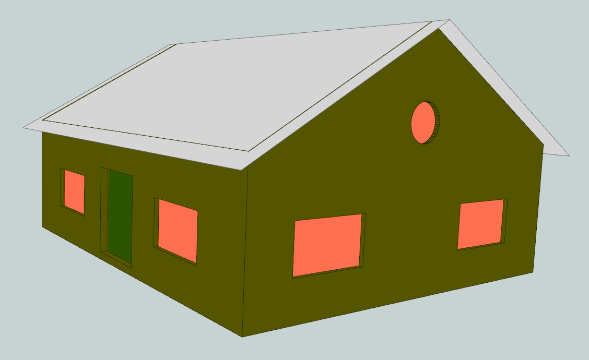
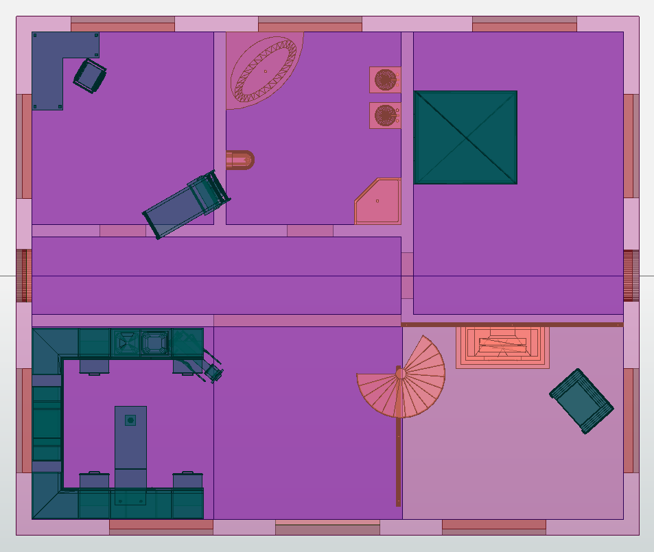

# Change Log

### 0.6.0 - See [sample file in CityGML 3.0](output/FZKHaus_v3.gml)

FZKHaus in 3D              |  FZKHaus in 2D
:-------------------------:|:-------------------------:
  |  

---------

##### NEW

* Added support for **Module `CITYFURNITURE`**

##### FIXES

* **Module `APPEARANCE`**:
    * Fixed transformation of `app:target` elements (see [`c9f02dd`](https://github.com/tum-gis/citygml2-to-citygml3/commit/c9f02ddc376e1c63b22f0d5fe0497852a3d26a8f))
    
  
### 0.5.0

##### UPDATES

* **Others**:
    * Updated the schemata, transformation and sample CityGML 3.0 datasets accordingly to the new release of [CityGML-3.0CM / 3.0.0-draft.2019.06.05.1](https://github.com/opengeospatial/CityGML-3.0CM/releases/tag/3.0.0-draft.2019.06.05.1) and [CityGML-3.0Encodings / 3.0.0-draft.2019.06.05.1](https://github.com/opengeospatial/CityGML-3.0Encodings/releases/tag/3.0.0-draft.2019.06.05.1) (see [`f821e8b`](https://github.com/tum-gis/citygml2-to-citygml3/commit/f821e8b6575dfd62dcff21604dc5356c27cc5b63)) 

##### FIXES

* **Module `BUILDING`**:
    * Fixed transformation for `BuildingPart` (see [`3fb2b87`](https://github.com/tum-gis/citygml2-to-citygml3/commit/3fb2b87f804c5914317ffabaa454d8c96009de3e) and [`875bc6b`](https://github.com/tum-gis/citygml2-to-citygml3/commit/875bc6bd4e7d7abf81a4a97c93225d15c83883f7))
    
        
### 0.4.0

##### NEW

* **Module `BUILDING`**:
    * Transformation from `bldg:Window` to `con:WindowSurface` and `bldg:Door` to `con:DoorSurface` (see [`67697b8`](https://github.com/tum-gis/citygml2-to-citygml3/commit/67697b8473e6d6858375d49a116dd5da77da283c))
    * Transformation from `bldg:yearOfRenovation` to `con:constructionEvent` (with ``event`` = `endOfRenovation` and `dateOfEvent` = standardized value of `yearOfRenovation`) (see [`3d1adde`](https://github.com/tum-gis/citygml2-to-citygml3/commit/3d1addebce9483bbbb2d33902339d7d2cad45f94))

##### UPDATES

* **Module `APPEARANCE`**:
    * Element `app:surfaceDataMember` changed to `app:surfaceData` (see [`653bc43`](https://github.com/tum-gis/citygml2-to-citygml3/commit/653bc43b9922fcae75cbbaf5f59048d6ee15cf34))
    * Element `app:target` changed to `app:textureParameterization` (see [`ef3c626`](https://github.com/tum-gis/citygml2-to-citygml3/commit/ef3c626d1c54a168687357c9625a6b0794cac7de))
    * Element `app:appearance` changed to `appearance` and `app:target` of `app:TextureAssociation` changed to `app:textureParameterization` (see [`85b6705`](https://github.com/tum-gis/citygml2-to-citygml3/commit/85b6705e4e2cd8106ec23f831147e22facc16088))
    
* **Module `BUILDING`**:
    * Element `bldg:interiorRoom` changed to `bldg:buildingRoom` (see [`177a51a`](https://github.com/tum-gis/citygml2-to-citygml3/commit/177a51a09fc26a043fe1dad479eb43001503986c))
    * Class `bldg:Room` changed to `bldg:BuildingRoom` (see [`3c1dde6`](https://github.com/tum-gis/citygml2-to-citygml3/commit/3c1dde6cd463cc3c064cb2a98c87fddf00141e74))
    * Element `bldg:roomInstallation` changed to `bldg:buildingInstallation` (see [`ef5d7d1`](https://github.com/tum-gis/citygml2-to-citygml3/commit/ef5d7d1d932ff77d7188223fe12d866a5f7d7d68))
    * Add first transformation for element `bldg:buildingSubdivisionInstallation` (see [`8f6eccd`](https://github.com/tum-gis/citygml2-to-citygml3/commit/8f6eccda392d2e54935ddf4d4497b0c0f0ed89a2))
    * Element `bldg:interiorFurniture` changed to `bldg:buildingFurniture` (see [`7b9692b`](https://github.com/tum-gis/citygml2-to-citygml3/commit/7b9692b60277f20dda486eb9087f972715b48baf))
    * Element `bldg:measuredHeight` changed to `con:height` (see [`7d4f0f9`](https://github.com/tum-gis/citygml2-to-citygml3/commit/7d4f0f909c8e8e40617ffee7c2e1a1238e7dee30))
    * Update `bldg:yearOfConstruction` and `bldg:yearOfDemolition` (see [`0f6d02a`](https://github.com/tum-gis/citygml2-to-citygml3/commit/0f6d02af0a55ceb1a10241287d082b165c63b7fc) and [`4576587`](https://github.com/tum-gis/citygml2-to-citygml3/commit/45765877ffe0a60231cbe20c4dab3c363bad3404))
    * Change class `AbstractSpaceBoundaryType` to `AbstractThematicSurfaceType` (see [`1b21f23`](https://github.com/tum-gis/citygml2-to-citygml3/commit/1b21f23d418a3e9b1cdc04e3d838325bce9ac513) and [`3d6d956`](https://github.com/tum-gis/citygml2-to-citygml3/commit/3d6d9564a2882e3099002d1e9aa493ba4cba9500))
        
* **Module `CONSTRUCTION`**:
    * Class `AbstractConstructionSurface` now has an element `con:closureSurface` of type `Core:ClosureSurface`, which inherits `Core:AbstractThematicSurface` (see [`3d6d956`](https://github.com/tum-gis/citygml2-to-citygml3/commit/3d6d9564a2882e3099002d1e9aa493ba4cba9500))
    * Element `bldg:opening` changed to `con:fillingSurface` (see [`9b8232e`](https://github.com/tum-gis/citygml2-to-citygml3/commit/9b8232ebb1ced58c472c5888a16440ad2fe89a29) and [`737ff05`](https://github.com/tum-gis/citygml2-to-citygml3/commit/737ff05d9e1e039b30ca2dcccd97b39880f384f1))

* **Module `CORE`**:
    * Remove `VoidSurface` (see [`b7bbdbe`](https://github.com/tum-gis/citygml2-to-citygml3/commit/b7bbdbeffe38398d09fe0305078c10d6524e6f86))
    
* **Others**:
    * XSDs have been updated to version March 2019 (for all recorded versions, see [`xsds`](xsds)) (see [`d2e59b9`](https://github.com/tum-gis/citygml2-to-citygml3/commit/d2e59b9a03daa41cc09b5f145350594b58680ef7))
    * The runnable `jar` file has been renamed from `Transform.jar` to `citygml2-to-citygml3.jar` (see [`c11c539`](https://github.com/tum-gis/citygml2-to-citygml3/commit/c11c539c1c05d608fc04c3f45a1cad9e60d75af2) and [`72cbfd2`](https://github.com/tum-gis/citygml2-to-citygml3/commit/72cbfd2fb1772ab2a07aa4a3af4615f77cfa2096))
    
##### FIXES

* **Module `APPEARANCE`**:
    * Fixed a bug that caused `Appearance` matching to not include all appearances (see [`bbb72d1`](https://github.com/tum-gis/citygml2-to-citygml3/commit/bbb72d19ada22d59790ed0a2dca421432e187e68))